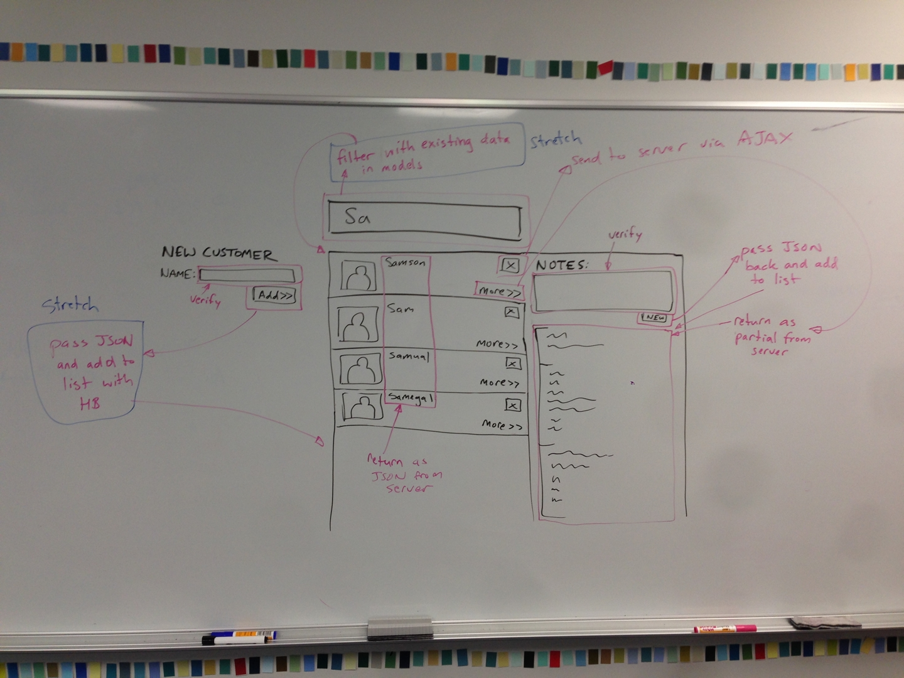

# Personal Projects

This repository is part of the Personal Project series for Phase 2. This is 1 of the 3 Personal Projects for this phase. These projects are intentionally open ended but aim to cover all the Learning Competencies with your project. The instructors are available to answer any questions you have around these projects.

## Submission Process

1. Clone this repository.
2. Create a branch with your name.
3. Commit and push up to origin.
4. Create a pull request.
5. Tag an instructor on your pull request for review or when you are done.

# Client Side App

The goal of this Personal Project is to build a client side web application. For Rubyists this means you will be basing your project off of the [Sinatra Web App started on this branch](../../tree/rubyists) and for Sharpies the [ASP.NET MVC app started on this branch](../../tree/sharpies).

### Learning Competencies

The things we will be looking to see if you have learned in this project are:
  - **Write custom event handlers in JavaScript or jQuery**
  - **Use AJAX to retrieve HTML from the server and replace or append them to a website**
  - **Use AJAX to retrieve JSON from the server and then modify the page based on the JSON**
  - **Use JSON to pass data via and AJAX call and modify the DOM**
  - Use URL parameters to pass data into a server application
  - Write OO JavaScript
  - Jasmine testing
  - Implement clean and flexible interfaces between objects
  - Separate my view concerns from my data verification concerns
  - Be able to map the flow of data through a web application
  - Use HandlebarsJS or another JS templating library to convert JSON to HTML *(stretch)*

### User Stories

We are going to create an online [customer relationship management](http://en.wikipedia.org/wiki/Customer_relationship_management) app.

- A user can see a list of customers
- A user can delete a customer
- A user can see all the notes for a customer by clicking "more" link for any listed customer
- A user can add a new note
- A user can filter the list of customers by typing in a text search input *(stretch)*
- A user can add a new customer with a name *(stretch)*

### Example UI

